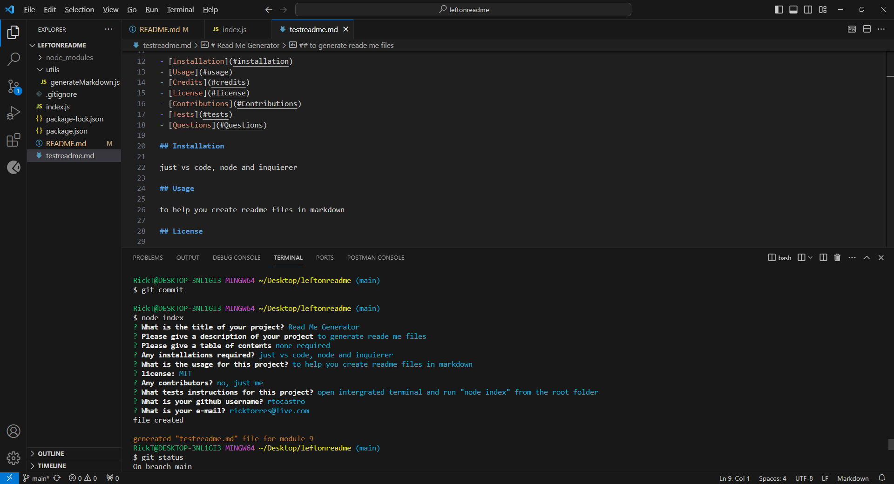

# READ ME GENERATOR

## Description

Generates readme.md file for module 9 acceptance criteria. 

## Table of Contents (Optional)

If your README is long, add a table of contents to make it easy for users to find what they need.

- [Installation](#installation)
- [Usage](#usage)
- [Credits](#credits)
- [License](#license)
- [Badges](#badges)
- [Features](#features)
- [How To Contribute](#How_To_Contribute)


## Installation

What are the steps required to install your project? Provide a step-by-step description of how to get the development environment running.

## Usage

Provide instructions and examples for use. Include screenshots as needed.

To add a screenshot, create an `assets/images` folder in your repository and upload your screenshot to it. Then, using the relative filepath, add it to your README using the following syntax:

    ```md
    
    ```

## Credits

No collaborators

## License

None

## Badges

None

## Features

Dynamically produces readme.md file by using the intergrated terminal simply by running "node index"

## How to Contribute

Get ahold of me at http://github.com/rtocastro or send me an email at ricktorres@live.com